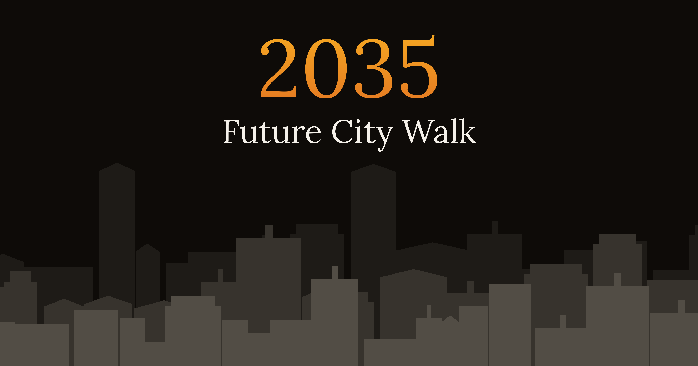

# Future City Walk 2035 – Eine interaktive Foresight Experience

Wie könnte die Stadt der Zukunft aussehen, in der du morgen leben wirst?

Future City Walk 2035 ist eine interaktive Foresight Experience. Ein 15-minütiger Spaziergang durch vier sehr unterschiedliche Stadt-Zukünfte, die auf ausgearbeiteten Szenarien basieren.

## Zur Experience

👉 https://floriandavidzeiser.github.io/future-city-walk2035/

🔊 Mit Ton erleben, Dauer ca. 15 Minuten
🌐 Stabile Internetverbindung erforderlich

## Worum es geht

Jede Stadt funktioniert nach einer anderen Logik urbaner Zukunft und repräsentiert einen anderen Szenario-Archetyp. Du tauchst mit vier Protagonist:innen in ihre Städte ein, triffst kleine Entscheidungen und rekonstruierst, was passiert ist. Am Ende wartet ein persönliches „Foresight-Profil".

Zu beachten: Die vier Zukünfte sind keine Prognosen. Sie sind Denkräume.

## Features

- Browser-basierte Experience, keine Installation nötig
- Vier narrative Szenarien mit eigener Atmosphäre und eigener Stimme
- KI-generierte Sprecher:innen und Soundtrack, eingebunden als MP3
- Vier Protagonist:innen, die dich durch ihre Städte begleiten
- Mikro-Entscheidungen, Rekonstruktionen und Reflexionen entlang des Weges
- Persistenter Fortschritt, lokal im Browser gespeichert
- Persönliches Foresight-Profil am Ende des Walks
- Teilbare Profilkarte

## Information und Erleben

> *„Szenarien sind keine Prognosen. Zusammenfassungen sind keine Erlebnisse. Der Unterschied ist der ganze Punkt."*

Was mich bei diesem Projekt besonders interessiert hat: Der Unterschied zwischen Information und Erleben. Meine These: Foresight-Arbeit, die nur gelesen wird, erreicht nicht dasselbe wie Foresight-Arbeit, die man erlebt. Die Experience ist deshalb darauf angelegt, durchgegangen zu werden, nicht zusammengefasst. Der Wert steckt im Durchgehen, nicht im Überfliegen.

## Entstanden mit KI

Dieses Projekt ist ein persönliches Experiment.

Nach dem Buch *AI Moment* Anfang 2023 und dem kleinen Arcade-Experiment *Data Center Guardian* im Winter 2025 wollte ich in meinem neuen Experiment herausfinden, wie weit man mit KI-Tools aktuell in Richtung narrativer, inhaltlich anspruchsvoller Formate kommt.

Entwickelt gemeinsam mit verschiedenen KI-Tools für Text, Stimmen, Dramaturgie und Umsetzung. Co-Creation, so wie schon das Buch und das Arcade-Experiment davor. Und wie schon bei den Projekten davor: trotz aller KI-Tools ein aufwendiger Prozess.

Weitere Experimente dieser Linie:

- *AI Moment*, gemeinsam mit ChatGPT verfasstes Buch
- Eine Vielfalt KI-generierte Bilder und kurze KI-gestützte Filmszenen
- Einsatz von KI in Storytelling und Corporate Learning
- *Data Center Guardian*, ein kleines Browser-Arcade-Experiment

Future City Walk 2035 führt diese Linie in Richtung interaktiver Foresight fort.

## Lizenz

Creative Commons Attribution-NonCommercial 4.0 International (CC BY-NC 4.0)

Du kannst den Code für nicht-kommerzielle Zwecke verwenden und anpassen, solange du angemessen Credit gibst und auf dieses Repository verlinkst.
